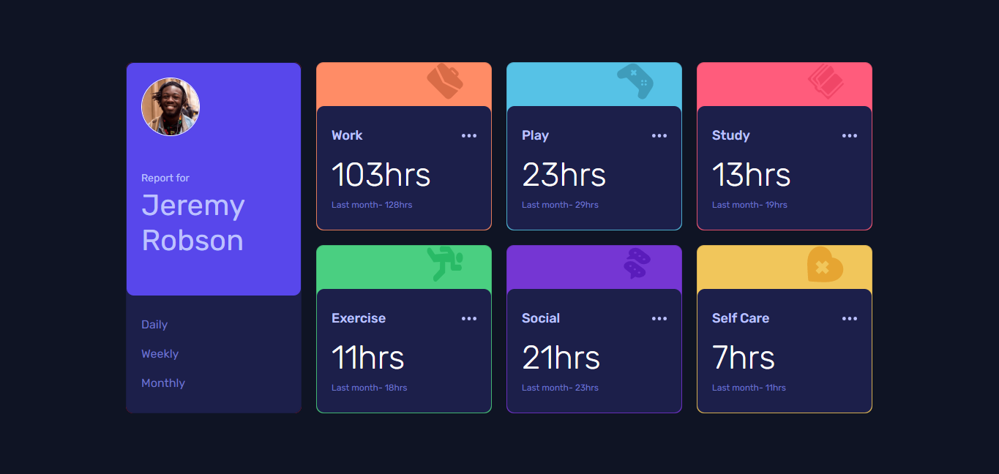
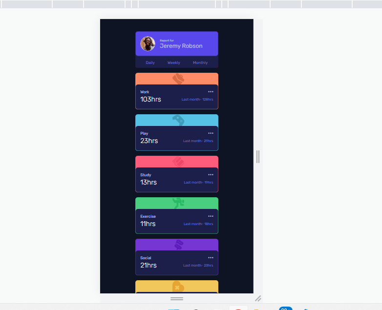

# Frontend Mentor - Time tracking dashboard solution

This is a solution to the [Time tracking dashboard challenge on Frontend Mentor](https://www.frontendmentor.io/challenges/time-tracking-dashboard-UIQ7167Jw). Do look at the solution and give your valuable feedback 

## Table of contents

  - [The challenge](#the-challenge)
  - [Screenshot](#screenshot)
  - [Links](#links)
- [My process](#my-process)
  - [Built with](#built-with)
  - [What I learned](#what-i-learned)
- [Author](#author)
- [Acknowledgments](#acknowledgments)

### The challenge

Users should be able to:

- View the optimal layout for the site depending on their device's screen size
- See hover states for all interactive elements on the page
- Switch between viewing Daily, Weekly, and Monthly stats

### Screenshot

### Links

- Solution URL: [Solution](https://github.com/thapa14/Time-tracking-dashboard-with-reactJS)
- Live Site URL: [Add live site URL here](https://your-live-site-url.com)

## My process

- This is my first project with React.
- used my basic knowledge of react and bootstrap to design it.
- First made it for desktop screen and then for other devices.
- used grid for desktop design. 

### Built with

- Semantic HTML5 markup
- CSS custom properties
- Flexbox
- CSS Grid
- [React](https://reactjs.org/) - JS library

### What I learned

This is my first react project. I didn't knew from where should i start. Then i made it by step by step.

Here i learned how can i give styling to react-components. how can i give styling to the dynamic components. 

## Author

- github - [@thapa14](https://github.com/thapa14)
- Frontend Mentor - [@thapa14](https://www.frontendmentor.io/profile/thapa14)
- Instagram - [@the_3_eyed_raven](https://www.instagram.com/the_3_eyed_raven/)

## Acknowledgments

I want to thanks Loveleet Joshi for helping me in this project.
